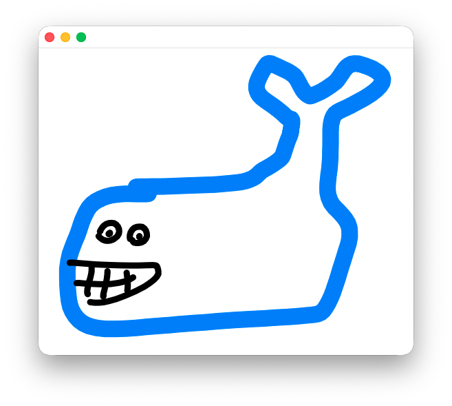

# CICD Docker helpers

This folder hosts the Docker build context for the `giant-training` image, which bundles CUDA, Python/JAX, s5cmd, and Tailscale. The container is driven by `/usr/local/bin/entrypoint.sh`, so every customization happens through environment variables and bind mounts.

## Common run arguments

Use the prebuilt image or build from this folder (for example `docker build -t giant-training CICD/Docker/giant-training`). Always bind your workspace and keep `/proj` mounted so the entrypoint can find `giant-data` and the repo.

```bash
docker run --pull always -d --gpus all \
  --name giant-training \
  --mount type=bind,source="$HOME/GIANT",target=/proj \
  -e TS_AUTHKEY="" -e SYNC_BUCKET="" \
  bonanc/giant-training:latest
```

Then `docker exec -it giant-training bash` to enter.

## Environment variables

### S3 / R2 sync
The entrypoint syncs `/proj/giant-data` from an S3-compatible bucket via `s5cmd` before touching the repository. Configure it with:

- `SYNC_BUCKET` (string, default `giant-data`) – R2/S3 bucket name (no `s3://` prefix) that holds your data.
- `SYNC_DIRS` (comma-separated list, optional) – limit sync to specific prefixes / objects. Example: `SYNC_DIRS="Dir/Dir/,Dir/file.txt"`. Entries ending with `/` are treated as directories (synced recursively), others as single files (copied into the same relative path).
- `FORCE_SYNC` (`0`/`1` or `false`/`true`, default `0`) – set to force a resync even when the sync marker exists. Without this, the container only syncs once per unique `SYNC_DIRS` list (the marker name includes a SHA256 of the list).

When you leave `SYNC_DIRS` empty, the image falls back to the previous `s5cmd sync --size-only "s3://${SYNC_BUCKET}/*"` behaviour.

### Tailscale
The entrypoint boots `tailscaled` and runs `tailscale up` with the following overrides:

- `TS_AUTHKEY` (string) – required for unattended login.
- `TS_HOSTNAME` (default `gpu-box`) – used for the Tailscale device name.
- `TS_TAGS` (default `tag:gpu`) – tags advertised to the control plane.
- `TS_ACCEPT_DNS` (default `false`) – passes `--accept-dns=` to `tailscale up`.
- `TS_ENABLE_SSH` (`true`/`false`, default `true`) – advertise `--ssh` if desired.
- `TS_EXTRA_ARGS` – space-separated string appended to `tailscale up` for custom arguments.

State is persisted under `/var/lib/tailscale` inside the container, so you can reuse the same container to keep the daemon keys.

### Repository and pip install

The entrypoint always mounts `/proj`, expects your repo to live at `/proj/SUPER-GIANT`, and clones/pulls it from `https://github.com/DebelToni/SUPER-GIANT` if missing. After syncing data it installs the repo with `pip install -e` when `pyproject.toml` or `setup.py` exists.

## Tips

- Mount `giant-data` from a persistent directory if you want to reuse the synced artifacts: `--mount type=bind,source="$HOME/giant-data",target=/proj/giant-data`.
- When testing new sync paths, set `FORCE_SYNC=1` to ignore the cached marker and re-download everything.
- Use `SYNC_BUCKET` together with `SYNC_DIRS` to simulate downloading only the artifacts you need (e.g., checkpoints in `checkpoints/` plus one config file).

For a quick reminder on how to run the container, see the main project's `README.md` next to the example invocation.



