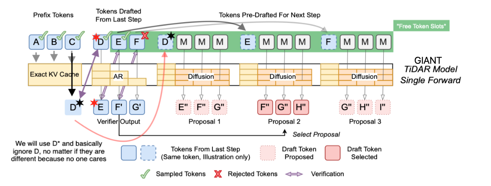
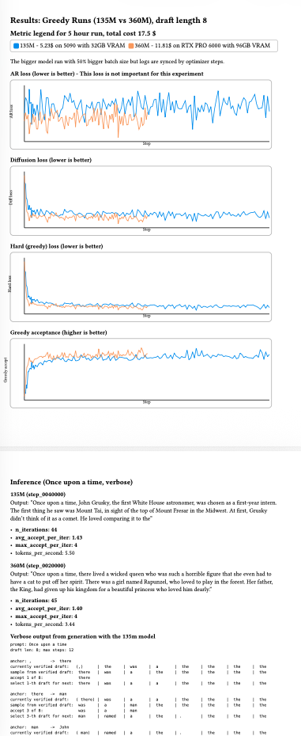

# GIANT TiDAR

This folder is my attempt at replicating and extending the results from the [Think in Diffusion, Talk in Autoregression](https://arxiv.org/pdf/2511.08923) paper by . <br><br>
I am currently investigating:
- How KL divergence in the loss affects diffusion draft performance (testing both forward and reverse).
- How using a token sampled from the previous verified draft (or from prefill) as the first draft token changes worst-case rejection and divergence from the true AR distribution.
- How targeted data curriculum and additional loss terms can reduce the data needed for good drafting.

---

### Intro: How TiDAR works in the original paper

TiDAR trains a single decoder-only transformer under two attention regimes: standard causal next-token prediction (Talk/AR) and blockwise bidirectional masked prediction (Think/Diffusion). At inference, one forward pass verifies a draft of K tokens and simultaneously produces K candidate predrafts for every possible accept count. The verifier accepts drafts speculatively, then selects the corresponding predraft as the next proposal.


Reference how normal speculative decoding works:


---

### My additions to TiDAR: Anchor-TiDAR + Loss terms

1. How my loss looks:

$$
\mathcal{L} = \alpha L_{AR} + \beta L_{Diff} + \rho KL_{fwd} + \chi KL_{rev} + \delta L_{hard}
$$

Where:
- `alpha`: weight on AR next-token prediction loss.
- `beta`: weight on diffusion denoising loss.
- `rho`: forward KL `KL(stopgrad(P_AR) || Q_Diff)` (mode-covering, penalizes missing AR mass).
- `chi`: reverse KL `KL(Q_Diff || stopgrad(P_AR))` (mode-seeking, penalizes extra Diff mass).
- `delta`: hard agreement `CE(onehot(argmax stopgrad(P_AR)), logits_diff)` (greedy alignment).

The idea is that in training runs we can choose to add or remove terms based on if run is made for maximum acceptance or minimum divergence from AR distribution. The training pipeline allows per stage loss for best alignment.

2. Anchor-TiDAR:

Anchor-TiDAR samples an anchor token from the previous AR logit and commits it immediately, then verifies positions 1..K-1 only. This guarantees at least +1 token progress per step and removes the worst-case no-progress case when all drafts reject, while keeping the same single-pass predraft structure.



Visual example of how Anchor-TiDAR works during inference:

We input this at K=5:
A D1 D2 D3 D4 M00 M01 M02 M03 M04 M10 M11 M12 M13 M14 M20 M21 M22 M23 M24 M30 M31 M32 M33 M34 M40 M41 M42 M43 M44
(we also have in KV cache any prefix)

```
A   D1  D2  D3  D4
    M00 M01 M02 M03 M04
        M10 M11 M12 M13 M14
            M20 M21 M22 M23 M24
                M30 M31 M32 M33 M34
                    M40 M41 M42 M43 M44
```
^ Here Mij sees the prefix + from the current pass the tokens from the first row to the left of the Mi0 token ^

Example over multiple steps:
```
Prefill Input -> Output after sample
ABC MMM  -> BCD* DEF

Decode step 1 input:
D*EF MMM MMM MMM

Decode step 1 output after sampling:
E*F'G' EFG FGH GHI

Now we check if E* is E from the draft on the input (assume success). Then we check F' to F of the input (assume success). That means we accept the last proposal GHI.

Decode step 2 input:
(note here we will take G' that we sampled from F on last step and replace it in the GHI block)
G'HI MMM MMM MMM

Decode step 2 output after sampling:
H*I'J' HIJ IJK JKL
Now we check that I' matches the output from I in the input but for example I' != I at the input. So we select proposal 2 which is IJK

Decode step 3 input:
(Here we take I' sampled from last step instead of the I that is in the IJK block).
I*JK
```

---

Latest training results:

Tested how model capacity affects drafting performance - tested smollm-135m vs smollm-360m on the exact same [data config](./data_pipeline/data_configs/Greedy_exp_500m.yml) with the same [training config][./model/training_configs/Greedy_exp_135m.yml]
<br>
Greedy runs (135M vs 360M, draft_len=8) used the hard (greedy) agreement loss to reach avg_accept_per_iter 1.43 (135M) / 1.40 (360M), and the results are documented [here. Small preview:](Docs/Results_Greedy_runs_135_360.pdf).
[](Docs/Results_Greedy_runs_135_360.pdf)
