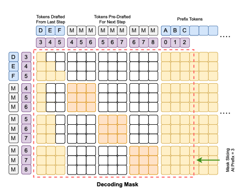
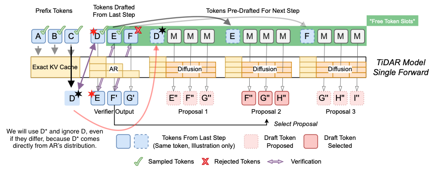
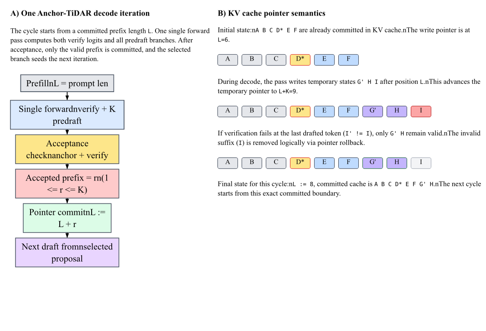

# Anchor-TiDAR Worst-Case Decoding Optimization

## 1) Objective

This document formalizes an inference-time modification to TiDAR that improves worst-case progress guarantees while preserving the single-pass decode structure.

Reference paper:
- TiDAR: <https://arxiv.org/pdf/2511.08923>

## 2) Baseline Context

### 2.1 Classic speculative decoding motivation

Speculative decoding exploits the fact that modern GPUs can process multiple token positions in one pass with relatively low incremental overhead compared to strict token-by-token execution.

### 2.2 TiDAR single-model mechanism

TiDAR trains one decoder-only model with two roles:
- AR verification role (causal next-token path)
- diffusion draft role (future token proposals)

At inference, TiDAR computes verification and predraft outputs in one forward pass through structured masks.

Illustrative flow (K = 3):
- Baseline decoder: `ABC -> BCD`, then sample `D`
- TiDAR-style pass: `ABC [MMM] -> BCD DEF`
  - `D` corresponds to the AR next-token path
  - `DEF` are diffusion-style future proposals

The corresponding inference mask structure is:

## 3) Baseline Limitation

In the baseline TiDAR decode loop, if all drafted tokens are rejected in a step, progress can degrade because the system needs another forward pass to recover a new usable draft chain. This is the key worst-case behavior targeted by the modification below.

## 4) Proposed Modification: Anchor-TiDAR

Anchor-TiDAR replaces the first drafted token in each decode cycle with a guaranteed token `T*` sampled from the true AR path of the previous cycle (or prefill boundary).

For a draft length `K`, the effective decode input uses:
- anchored token: `T*`
- remaining draft tokens: positions `2..K`
- existing predraft mask branches

Conceptual diagram:

## 5) Inference Semantics

Within one decode cycle:

1. Construct the decode input with anchored token `T*`.
2. Execute one forward pass.
3. Verify drafted positions after the anchor.
4. Accept the longest valid prefix.
5. Select the corresponding predraft branch for the next step.
6. Commit accepted states via KV pointer update.

Important property:
- `T*` is never speculative in that cycle. It is already sampled from the true AR distribution before the cycle starts.

Therefore, each cycle guarantees at least one committed token (`+1` progress) even when all post-anchor drafted tokens are rejected.

## 6) KV Cache Behavior

The optimization remains compatible with pointer-based KV cache commit/rollback semantics.

Operationally:
- temporary decode states are materialized during the pass,
- acceptance determines committed prefix length,
- rejected suffix is discarded logically by pointer rollback,
- next cycle starts from the committed boundary.

## 7) Correctness and Efficiency Implications

### 7.1 Correctness

Anchor-TiDAR preserves AR-equivalent conditioning for committed tokens because the anchor is sourced from the true AR path. Predraft selection remains mask-consistent with accepted prefix state.

### 7.2 Worst-case robustness

Compared to baseline TiDAR, Anchor-TiDAR removes the no-progress edge case under full draft rejection and enforces monotonic decode advancement.

### 7.3 Throughput trade-off

The method keeps the one-pass structure and typically retains most of TiDAR's parallel efficiency benefits while improving stability of decode progress.

## 8) Optional Compute Variants

Two practical variants are considered:

- **TiDAR-BSS (Better Safe than Sorry)**
  - keeps full branch computation for conservative robustness.

- **TiDAR-LW (Light Work)**
  - reduces branch workload by shrinking effective draft branch width,
  - may reduce compute but can weaken conditioning quality,
  - should be validated empirically before production use.

## 9) Recommended Validation Plan

To evaluate this modification rigorously:

1. Compare baseline TiDAR vs Anchor-TiDAR on identical checkpoints.
2. Track acceptance length distribution, tokens/s, and latency percentiles.
3. Measure worst-case behavior on adversarial prompts.
4. Validate quality parity on standard downstream text tasks.
5. Run ablations for BSS vs LW under the same hardware and decode settings.

This document is intended as an implementation-level design note for the current repository and should be read together with `TiDAR/Docs/Implementation_Notes.md` and `TiDAR/Docs/TiDAR_docs.md`.
