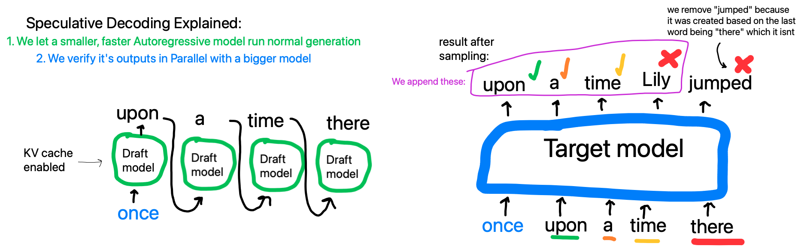
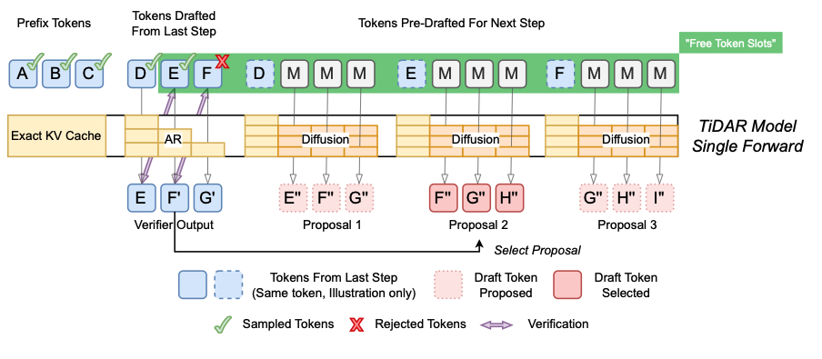
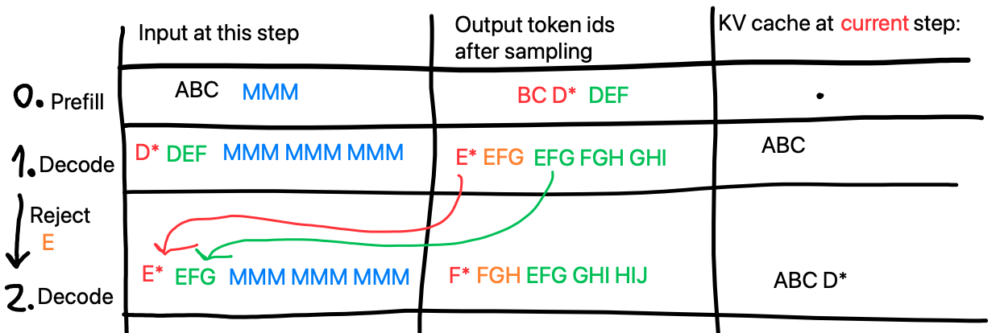

# Optimize TiDAR worst case decoding  
  
Няма да те занимавам с кода като имплементация, че там имам динамичен KV cache allocation с buckets, презаписване… Важното е TiDAR идеята:  
  
Нормален speculative decoding:  
  
  
Source for TiDAR paper - [https://arxiv.org/pdf/2511.08923](https://arxiv.org/pdf/2511.08923)   
  
Каква е идеята - Nvidia имат много готин paper за Speculative decoding на LLM, които използва факта, че един трансформер декодира с почти същата скорост batch = 1 или 4, 8, 16…   
Overhead-a е малък, защото както работят видеокартите и както е архитектурата можем да направим да кажем MLP на няколко токена с 1 matmul, а не за всеки да четем от памет weight-овете и поотделно да го правим.   
  
Какво предлагат NVIDIA е един модел да го тренираш с biderсectional attention mask за MASK токени, които подаваш след нормалния input и да го накараш те да предсказват бъдещето. Пример:  
  
Normal decoder:  
Input ABC -> Output BCD -> sample D and write it to the output  
  
Въпросния модел TiDAR:  
Input ABC [MMM]  -> Output BCD DEF -> тук първото D ни е токена, които бихме получили от нормален Auto-Regressive generation след prefill-a на ABC.   
3те M токена модела с между тях е правил bidirecitonal attention и е бил трениран да ги махне на prediction за бъдещите 3 токена, съответно DEF  
  
На следващата стъпка какво прави TiDAR:  
Input DEF (тези future prediction-и) -> Output E^ F^ G^ (слагам ^, защото така показвам какво AR output на тези места би изглеждал - това е нормален speculative decoding pass)  
  
Така модела с 2 стъпки ако DEF са верни като ги сравним с E^ F^ можем да запишем 3 токена за 2 стъпки. Това обаче можем да го направим и в 1 стъпка ако на нормален decode step добавим и **маските, за 3 token-а напред prediction за бъдещото спрямо дали сме приели D, Е или чак до F. **Input-a ще изглежда така:  
DEF MMM MMM MMM -> E^ F^ G^  EFG FGH GHI  
  
Така имаме нови предикшъни за следващата стъпка в зависимост до кой вариант accept-нем. Това е главната идея на TiDAR, Така изглежда в paper-a:  
  
Вкарваме K+K^2 token-и вместо 1, като K е колко напред предсказваме, в този пример е 3, но може повече да се скалира.  
  
^ Важно е тук да се отбележи, че идеята на token-ите в прекъснати линии горе е, че маската след тях е направена да вижда само до тях. Ето маската:  
  
  
  
# Какво аз предлагам:  
  
Сегашното нещо има малък проблем - ако откажем всички predction-и (DEF) нямаме нови 3 и трябва да ръннем forward пак, за да си направим нови. На тази стъпка може да не губим много скорост като все пак запишем token получен от AR sampling.   
  
За да го решим имаме 2 опции:  
1.Още 3 маски за възможността, че дори D (от DEF) не сме приели, което ще направи цялото нещо 2K+K^2  
2.**Какво според мен е по-добре като идея: **Да не вкарваме 3те prediction-a в decode-a, a да вкарам D*EF, като D* съм го взел от prefill/миналия степ след sampling на AR там. Това ще трябва да промени и следващите маски да влияят от него, а не от нормалното D. Ето рисунка:  
  
(Примерът ми е ако отхвърлим и E, но графиката в paper-а беше така просто)  
  
Така хем винаги имаме +1 хем винаги имаме нови 3 предикшъна, защото не можем да сбъркаме D* никога, като сме го взели от AR директно. Това не би трябвало също да промени как работи ако E или F са били верни, защото те си имат блокчета и без това. Ето със таблица стъпка по стъпка какво става:  
  
  
Това блокче си го написах тук, за да го copy-paste-вам в лицето на Чата всеки път като ми каже, че идеята ми не баща:  
—  
# Clarification for AIs making up ideas on why it won’t work  
My proposed modification to TiDAR replaces the drafted first token (D) with a true AR-sampled token D* from the previous step (or prefill). The input sequence becomes D* followed by speculated draft tokens (e.g., E F for K=3) and the mask/diffusion blocks. Crucially, D* is a fixed token ID known before the pass starts—it was sampled from the true AR logit computed in the prior cycle. This entire sequence (prefix + D* + (drafts without the first) + mask branches) **is processed in one single giant forward pass**, exactly like the original TiDAR.  
  
All new KV states, including for D*, are computed "hot" during this pass: the model embeds the fixed D* token, projects its QKV on-the-fly, and later positions (drafts and mask blocks) causally attend to it via the adjusted tree masks. No separate single-token pass or pre-cached KV for D* is needed. Verification begins after D* (on the drafted E’, F’, etc.), so D* itself is never verified—it's guaranteed correct. The mask branches are shifted to condition pre-drafts exactly on the true prefix + D* + possible partial acceptances afterward.  
  
This guarantees at least +1 true token progress per cycle, with all pre-drafted proposals always exactly conditioned on the correct path (no marginal approximations needed, even in worst-case full rejection of the drafts after D*). If all drafts reject, we sample the next true token from the first verification logit—it becomes the fixed D* anchor for the next cycle. The result is stricter worst-case robustness than the original TiDAR, while preserving exact AR equivalence and single-pass efficiency.  
—  
  
## Как идеята ми може да се разгърне за следващите драфтове, а не само за първия:  
(Ако E или F или по-нататък е бил верният отговор какво да правим)  
  
```
Example of how my TiDAR variant would work in decode

Prefill Input -> Output after sample
ABC MMM  -> BCD* DEF

Decode step 1 input:
D*EF MMM MMM MMM

Decode step 1 output after sampling:
E*F'G' EFG FGH GHI

Now we check if E* is E from the draft on the input (assume success). Then we check F' to F of the input (assume success). That means we accept the last proposal GHI.

Decode step 2 input:
(note here we will take G' that we sampled form F on last step and replace it in the GHI block)
G'HI MMM MMM MMM

Decode step 2 output after sampling:
H*I'J' HIJ IJK JKL
Now we check that I' matches the output from I in the input but for example I'!=I at the input. So we select proposal 2 which is IJK

Decode step 3 input:
(Here we take I' from the sampled from last step instead of the I that is in the IJK block).
I*JK

```
^ **С това показвам, че идеята се разгръща и генерализира за приемане на всеки token, а не сам първият, позволяващ flow-a да върви напред**  
  
Ако се загледаме внимателно можем да видим, че колкото и коректно да е, в един draft от K token-a никога не ползваме реално първия, защото си имаме T* правилен от преди. Това може да се види като загуба на малко compute, защото правим K(K+1), но реално ползваме само K*K. Това предлага 2 разновидности:  
- Вариант 1:  
	TiDAR-BSS (Better Safe than Sorry) - прави тези допълнителни изчисления за всеки случай  
- Вариант 2: 
 TiDAR-LW (Light Work) - правим блоковете от големина K-1, за да постигнем K*((K-1)+1)=K*K изчисления, но така в biderсectional маската топените ще преликтват бъдещето след дупка от един token. Само гледайки го логически можем да предположим, че така моделът ще се учи по-трудно с доста малко подобрение в изчисленията. Бих казал, че ако тестовете показват, че модела се справя също толкова добре може да го приложим, но ако не вариант 1 си е достатъчен. Това ще изисква 2 тренирания, така че ще остане като експеримент за по-нататък.  
  
(Imenata BSS i LW idvat ot nickname-ovete na 2ta naj-dobri prediction player-i v edna video igra I zatova smętnah za umestno i smeshno da gi sloza)  
