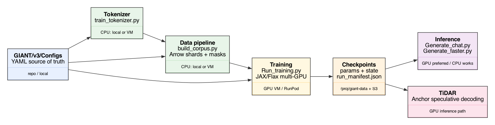
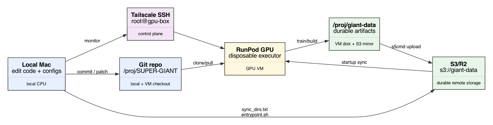
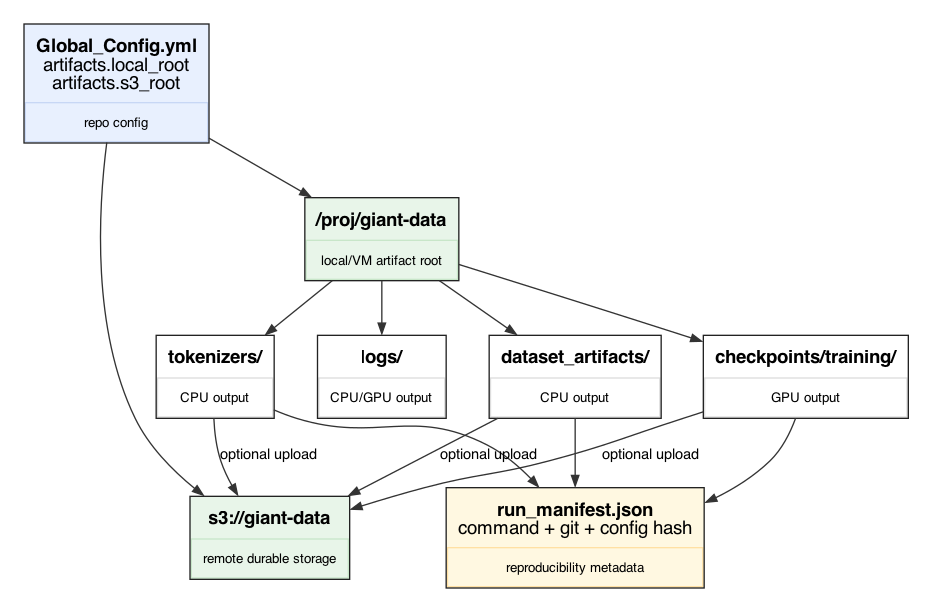

# SUPER-GIANT framework

One repo for custom LLM experiments: data → train → checkpoint → inference.

## Full pipeline



Main path:

```bash
sg configs --status recommended
sg tokenizer train --config GIANT/v3/Configs/Tokenizer/giant_chat_bg_en_bpe32k.yml
sg data build --config GIANT/v3/Configs/Data/giant_chat_pretraining_bg_en_900m_bpe32k.yml
sg train --config GIANT/v3/Configs/Training/1_pretraining_100m_bg_en_ctx256_32k_1p8b.yml
```

## GPU ops



Rule: GPUs are disposable, `/proj/giant-data` and S3 are durable.

## Artifacts



Mapping:

```text
/proj/giant-data/GIANT/foo  <=>  s3://giant-data/GIANT/foo
```

Each serious run writes `run_manifest.json`.

## Where to look

- v3 active code: [GIANT/v3/](../GIANT/v3/)
- config index: [GIANT/v3/Configs/registry.yml](../GIANT/v3/Configs/registry.yml)
- ops: [docs/OPERATIONS.md](OPERATIONS.md)
- artifact contract: [docs/ARTIFACTS.md](ARTIFACTS.md)
- TiDAR: [TiDAR/](../TiDAR/)
